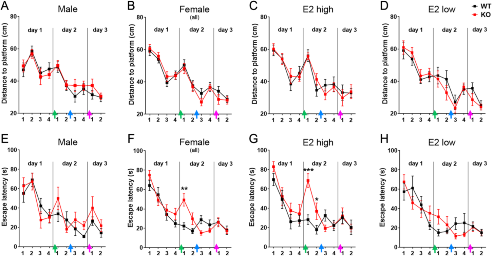

# Research-Paper

## Background
I'm transitioning from a career in neuroscience to becoming a data analyst. As many of the skills I've developed as a scientist are transferable to data analysis I'd like to showcase relevant skills as part of my portfolio:
[This scientific research paper](JOE220204.pdf) has been authored by me and written in collaboration with colleagues from the [Institute of Neuroanatomy](https://www.uke.de/english/departments-institutes/institutes/neuroanatomy/index.html) and the [Research Group Behavioral Biology](https://www.uke.de/english/departments-institutes/institutes/research-group-behavioral-biology/index.html) of the Center for Neurodegenerative Diseases in Hamburg. It's about behavioral neurobiology, molecular neurobiology, and electrophysiology.  

## Summary
The study investigated the role of a specific estrogen receptor called GPER1 in mice and found that it has different effects in males and females. In male mice lacking GPER1, anxiety was reduced, while in female mice, the fear response was increased, especially when estrogen levels were high. Both male and female mice with GPER1 deficiency had problems with spatial learning and memory. The study also found changes in brain activity and certain proteins in these mice, suggesting that GPER1 plays a complex and sex-specific role in brain function, which could be related to cognitive and mood disorders.

## Skills

1. **Analytical Skills** 

The execution of this scientific project demanded meticulous planning and a nuanced approach to data analysis. Taking charge of both behavioral testing and analysis, I strategized experiments to optimize results while minimizing the use of animals—a testament to my commitment to ethical research practices.

Confronted with limitations on data generation and navigating the intricacies of the non-linear relationship between sexes and estrogen levels, I engaged in rigorous critical analysis of complex datasets. Identifying patterns and extracting meaningful conclusions from extensive datasets underscored my proficiency in discerning subtle nuances, a skill seamlessly transferable from the realm of science to the dynamic landscape of data analysis.

2. **Quantitative and Statistical Skills**  

My expertise in statistical analysis spans a diverse range of parametric and non-parametric tests, acquired through extensive experience as a neuroscientist. Proficient in tests such as Student's t-test, ANOVA, MANOVA, linear regression, chi-square test, Mann-Whitney U Test, Wilcoxon Signed-Rank Test, and Kruskal-Wallis Test, I have seamlessly applied these methodologies across various scientific projects during my academic journey.

In the context of the present study, statistical analyses involved the Kolmogorov-Smirnov Test for assessing normal distribution and ANOVA for behavioral data. I adeptly navigated statistical software platforms, including SPSS, GraphPad Prism, Excel, and R-Studio, demonstrating versatility in my analytical toolkit.

3. **Data Visualization**  

I utilized GraphPad Prism to craft the figures in the paper, with a specific focus on showcasing Figure 2. This figure presented a unique challenge—visualizing 10 consecutive datapoints for two sexes, two genotypes, and two levels of the cycle stage within a single plot while emphasizing specific datapoints.

While the resulting plot may not be the most elaborate, its creation demanded a substantial effort to effectively convey our data's underlying concept. To address this complexity, we employed eight subplots and incorporated colored arrows strategically. This approach not only enhanced the visual appeal but also directed the reader's attention to the pivotal datapoints, reinforcing the significance of our findings.   

   

This screenshot provides a glimpse into the intricacies of the visualization and underscores my commitment to conveying data in a clear and compelling manner.

4. **Problem-Solving Skills**  

Navigating the complexities of our research, I initially explored sex differences in mice, concentrating on behavioral and cognitive abilities. Post-acquiring behavioral molecular data, we encountered non-linear and challenging-to-interpret effects.

To distill a coherent narrative, I crafted diverse visualizations focusing on specific data facets. These visual aids not only facilitated communication of ideas and approaches with colleagues but also played a pivotal role in shaping the cohesive story presented in the paper. The ability to convey intricate relationships visually proved instrumental in problem-solving throughout the project.

5. **Communication Skills**  

My adept communication skills were honed through collaborative ventures spanning my master's thesis. This joint effort involved my hometown university in Oldenburg, the university clinic in Hamburg, and the center for neurodegenerative diseases in Hamburg.

Regular progress updates and final thesis presentations became opportunities to engage with a diverse scientific community. I effectively communicated complex concepts to audiences with backgrounds in biology and medicine, each possessing distinct areas of expertise.

Post-master's, my collaborative endeavors expanded as I transitioned to a lab in Magdeburg. Here, interactions with PhD colleagues facilitated the exchange of novel ideas, contributing to a dynamic intellectual environment.

6.  **Data Management**  

All behavioral experiments under my purview were meticulously recorded through video documentation, providing a comprehensive basis for subsequent analysis. These records were not only confined to digital formats but were also meticulously detailed in paper protocols and my personal labbook, ensuring redundancy for data security. By employing a shared digital labbook alongside personal documentation, I ensured that subsequent researchers could seamlessly pick up where I left off, fostering collaboration and knowledge transfer within the scientific community.

The nomenclature employed in file naming exemplifies my dedication to clarity and systematic organization. Each video file adheres to a structured naming schema, encompassing crucial information such as animalID, Experiment Abbreviation, and Timestamp. Post-video analysis, corresponding Excel files were meticulously generated. [See here for an example](excel_sheets/WM_63_Tranfer_Trials.xlsx). This strategy not only streamlined the storage process but also facilitated easy cross-referencing of experimental data.

To maintain a holistic understanding of each experiment's context, I crafted a [centralized Excel file](excel_sheets/Behavior_Uebersicht.xlsx) encompassing essential details such as animal sex, birthdate, age during the experiment, and, notably, their cycle stage. This comprehensive approach not only facilitated individual experiment analyses but also provided a nuanced view of the animals' life stages and conditions.

7. **Domain Knowledge**

My expertise lies in the interdisciplinary realm of Behavioral and Molecular Neuro-Biology, with a pronounced emphasis on Endocrinology. This specialization stems from a robust foundation in basic neurobiological research, acquired through my undergraduate studies in auditory research. The culmination of this knowledge allowed me to seamlessly apply my skills to the intricate domain of endocrinology, where I delved into the complexities of behavioral research.

My research focus extended to the exploration of sex differences in mammals, a topic with profound implications for the healthcare and medicine fields. Recognizing the nuanced responses of male and female bodies to various drugs and treatments, I underscored the importance of inclusive research practices. It is crucial to acknowledge and address the divergent physiological responses between genders to advance our understanding and optimize healthcare strategies.

Despite the significance of gender-inclusive studies, there is a prevailing bias towards male-centric research models. This bias, driven by concerns over the potential uncertainty introduced by hormonal variations in female systems, poses a challenge to the comprehensive understanding of medical interventions. My commitment to overcoming such biases is reflected in my research, where I navigated the intricate landscape of sex-specific responses to uncover valuable insights.

By combining my foundational knowledge in auditory research, extensive experience in behavioral studies, and a focus on endocrinology, I have developed a unique perspective that transcends traditional disciplinary boundaries. This perspective not only enriches my approach to scientific inquiries but also positions me as a valuable contributor to the data analysis landscape, where a holistic understanding of diverse research domains is increasingly paramount.
